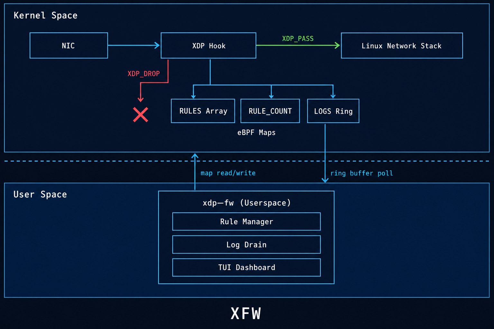
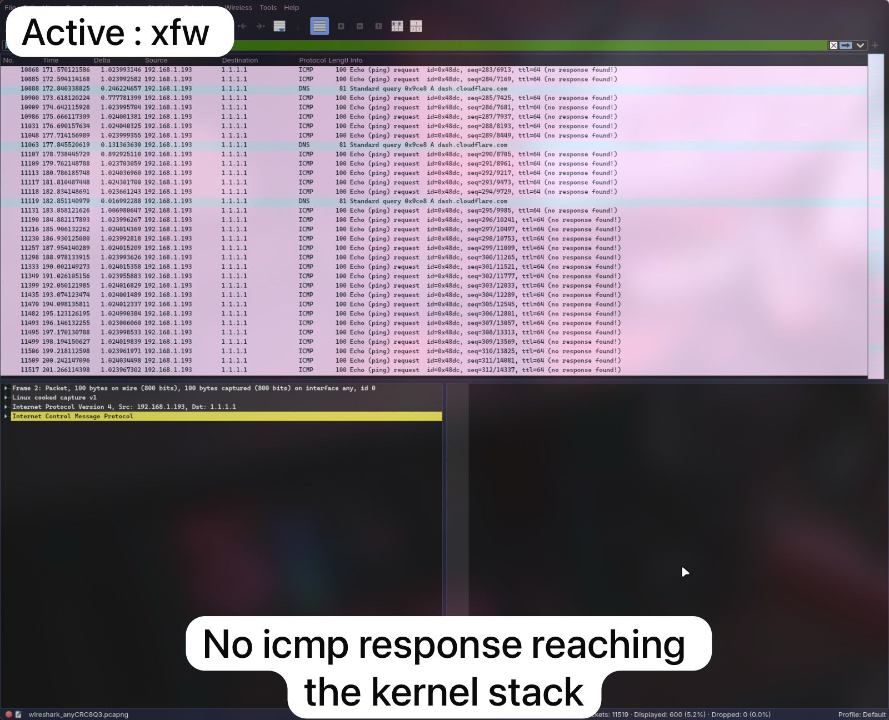
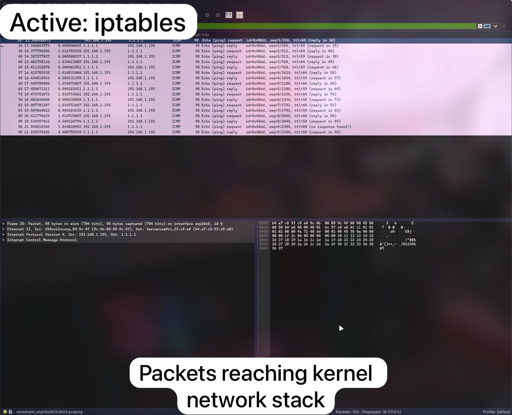

# XFW v1

A high-performance XDP firewall for Linux with a real-time terminal UI. Rules are enforced in-kernel via eBPF at the earliest point in the network stack — before the kernel allocates an `sk_buff` — delivering line-rate packet filtering with near-zero overhead.

## Features

- **XDP/eBPF packet filtering** — drop or allow traffic before it reaches the kernel networking stack
- **CIDR subnet blocking** — match entire subnets with rules like `block 10.0.0.0/8`
- **Live TUI dashboard** — split-pane view of allowed traffic, denied traffic, and system logs powered by [ratatui](https://github.com/ratatui/ratatui)
- **Interactive command shell** — add, list, and remove rules at runtime without restarting
- **Per-rule protocol filtering** — filter by TCP, UDP, ICMP, or any protocol
- **Hot rule management** — insert and remove rules that take effect immediately in the kernel

## Architecture





Packets hit the XDP hook before the kernel allocates any socket buffer. The eBPF program scans a shared `RULES` array (bounded by `RULE_COUNT`), applies the first matching rule, and returns `XDP_DROP` or `XDP_PASS`. Every verdict is pushed to a `LOGS` ring buffer that userspace drains every 50ms into the TUI.

### Crate layout

| Crate | Purpose |
|---|---|
| `xdp-fw-common` | Shared types (`Rule`, `FlowKey`, `LogEvent`), matching logic, constants — compiled for both eBPF and userspace |
| `xdp-fw-ebpf` | eBPF XDP program loaded into the kernel |
| `xdp-fw` | Userspace loader, TUI, command parser, rule management |

## Prerequisites

- Linux with kernel 5.15+ (XDP support)
- Rust stable + nightly toolchains:
  ```
  rustup toolchain install stable
  rustup toolchain install nightly --component rust-src
  ```
- bpf-linker:
  ```
  cargo install bpf-linker
  ```

## Build

```bash
cargo build --release
```

The build script automatically compiles the eBPF program and embeds it in the userspace binary.

## Run

XDP requires root privileges. The project is configured to use `sudo -E` as the cargo runner:

```bash
cargo run --release                    # default interface (enp10s0)
cargo run --release -- -i eth0         # specify interface
cargo run --release -- -i wlan0
```

Or run the binary directly:

```bash
sudo target/release/xdp-fw -i eth0
```

## Commands

All commands are entered in the `Exec` panel at the bottom of the TUI.

### Blocking & allowing

```
block <ip|cidr>                          block 1.2.3.4
block from <ip|cidr>                     block from 10.0.0.0/8
block port <port>[/<proto>]              block port 80/tcp
block port <port> proto <proto>          block port 443 proto tcp
block port <port> from <ip|cidr>         block port 22 from 192.168.0.0/16
allow <ip|cidr>                          allow 172.16.0.0/12
allow port <port> proto <proto>          allow port 53 proto udp
```

Aliases: `deny` works the same as `block`.

### Listing rules

```
rules                                    show all active rules
rules <ip>                               show rules matching an IP
```

Output:

```
#0   src=10.0.0.0/8       sport=*     dst=*                dport=*     proto=any   action=drop
#1   src=1.2.3.4           sport=*     dst=*                dport=443   proto=tcp   action=drop
```

### Removing rules

```
remove all                               clear all rules
remove <id>                              remove rule by index (e.g. remove 0)
remove <ip>                              remove all rules matching an IP
```

Aliases: `rm`, `del`, `delete`.

### Other

```
help [topic]                             show help (topics: block, allow)
clear                                    clear system log panel
esc                                      exit the program
```

## Rule matching

Rules are evaluated top-to-bottom (first match wins). Each field acts as a filter:

| Field | Wildcard | Meaning |
|---|---|---|
| Source IP | `*` (mask = 0) | Match any source |
| Dest IP | `*` (mask = 0) | Match any destination |
| Source port | `*` (port = 0) | Match any source port |
| Dest port | `*` (port = 0) | Match any dest port |
| Protocol | `any` (255) | Match any IP protocol |

CIDR matching uses bitmask comparison in the kernel: `(packet_ip & mask) == (rule_ip & mask)`. A `/24` mask is `0xFFFFFF00`, a `/32` is an exact match.

## Cross-compiling

```bash
CC=${ARCH}-linux-musl-gcc cargo build --package xdp-fw --release \
  --target=${ARCH}-unknown-linux-musl \
  --config=target.${ARCH}-unknown-linux-musl.linker=\"${ARCH}-linux-musl-gcc\"
```

Copy `target/${ARCH}-unknown-linux-musl/release/xdp-fw` to the target machine.

## License

Userspace code (`xdp-fw`, `xdp-fw-common`) is dual-licensed under [MIT](LICENSE-MIT) or [Apache 2.0](LICENSE-APACHE) at your option.

eBPF code (`xdp-fw-ebpf`) is dual-licensed under [GPL-2.0](LICENSE-GPL2) or [MIT](LICENSE-MIT) at your option.
